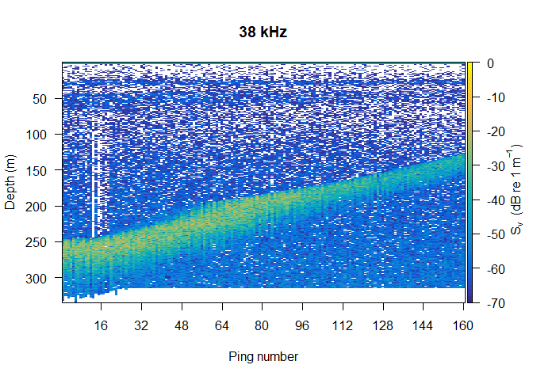
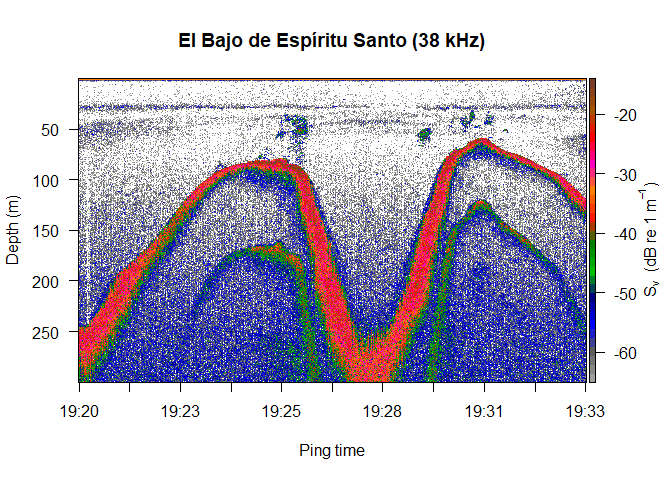

Procesamiento de archivos raw (EK80) en python (echopype) + R (echogram)
================
Equipo Proyecto 3

## Parte I. Python

Dado que tanto el código R como Python se ejecutó desde RStudio, la
primera vez se tuvieron que instalar varias librerías en la terminal con
`pip install 'libreria'.`

### Cargar librerías

NOTA: `cartopy` no se pudo instalar, por eso se comenta en el siguiente
bloque de código.

``` python
# cargar librerías
from pathlib import Path

import fsspec
import numpy as np
import geopandas as gpd
import xarray as xr

import matplotlib.pyplot as plt
from shapely.geometry import box
#import cartopy.crs as ccrs
#import cartopy.io.img_tiles as cimgt
#from cartopy.mpl.gridliner import LONGITUDE_FORMATTER, LATITUDE_FORMATTER

import echopype as ep
from echopype.qc import exist_reversed_time

import warnings
warnings.simplefilter("ignore", category=DeprecationWarning)
```

El procesamiento en Python consistió en convertir los archivos raw de
una ecosonda científica Simrad EK80 portable, en netCDF. Para ello se
leyeron los archivos raw como EchoData y se calculó el valor de $S_v$
agregando parámetros de calibración, para guardar en disco los datos
calibrados.

### Definir directorio y generar lista de archivos raw a procesar

``` python
import glob
rawdirpath = "rawdata" # directorio con archivos raw
s3rawfiles = glob.glob(f"{rawdirpath}/*.raw")
s3rawfiles # listado de nombres de archivos a procesar
```

    ['rawdata\\ebes202210-D20221011-T012021.raw', 'rawdata\\ebes202210-D20221011-T012301.raw', 'rawdata\\ebes202210-D20221011-T012542.raw', 'rawdata\\ebes202210-D20221011-T012820.raw', 'rawdata\\ebes202210-D20221011-T013100.raw', 'rawdata\\ebes202210-D20221011-T013341.raw', 'rawdata\\ebes202210-D20221011-T013619.raw', 'rawdata\\ebes202210-D20221011-T013856.raw', 'rawdata\\ebes202210-D20221011-T014137.raw', 'rawdata\\ebes202210-D20221011-T014430.raw', 'rawdata\\ebes202210-D20221011-T014705.raw', 'rawdata\\ebes202210-D20221011-T014946.raw', 'rawdata\\ebes202210-D20221011-T015226.raw', 'rawdata\\ebes202210-D20221011-T015500.raw', 'rawdata\\ebes202210-D20221011-T015741.raw']

### Parámetros ambientales para la calibración.

``` python
# falta incluirlo en la calibración!
env_params = {
    'temperature': 26.15,   # temperature in degree Celsius
    'salinity': 34.96,     # salinity in PSU
    'pressure': 25     # pressure in dbar
}    
```

### Procesamiento

Bucle de importación, cálculo de $S_v$ (calibrado) y exportación a
netCDF. NOTA: la carpeta para guardar archivos netCDF debe existir.

``` python
for i in s3rawfiles:
  ed = ep.open_raw(i, sonar_model='EK80') # EchoData
  ds_Sv = ep.calibrate.compute_Sv(ed, waveform_mode = "CW", encode_mode = "complex")
  # generar nombre para resultado
  ii = i.replace("rawdata\\", "")
  ii = ii.replace(".raw", "")
  nombre = "./rawdata/converted/"+ str(ii) + "_Sv_calib" + ".nc"
  # guardar como netCDF
  ds_Sv.to_netcdf(nombre)
```

## Parte II. R

### Importar y explorar un archivo netCDF en R

Antes de generar una función que pueda leer los archivos netCDF
anteriores, procesamos manualmente uno de ellos para explorar su
estructura y buscar los elementos necesarios para crear un objeto de
clase `echogram` que pueda ser usadas con el paquete del mismo nombre.

``` r
library(ncdf4)
nc <- list.files(path = "./rawdata/converted", pattern = glob2rx("*Sv_calib.nc"), full.names = TRUE)
ncf <- nc_open(nc[1])
```

Podemos inspeccionar el contenido del archivo

``` r
names(ncf$var)
```

     [1] "Sv"                    "echo_range"            "frequency_nominal"    
     [4] "temperature"           "salinity"              "pressure"             
     [7] "sound_speed"           "sound_absorption"      "sa_correction"        
    [10] "gain_correction"       "equivalent_beam_angle" "source_filenames"     
    [13] "water_level"          

Entre lo que nos interesa esta la matriz de $S_v$

``` r
Sv <- ncvar_get(ncf, "Sv") # importar valores de Sv
dim(Sv)
```

    [1] 21677   160     2

Del contenido de `Sv` nos interesa solamente la primera tabla de la
tercera dimensión, que corresponde a la primera frecuencia de
adquisición utilizada (38 kHz).

``` r
frq <- ncvar_get(ncf, "frequency_nominal")
frq
```

    [1]  38000 200000

``` r
Sv <- Sv[, , 1] # solo 38 kHz (primera tabla de la 3a dimensión)
```

Para un primer vistazo a estos datos se puede usar la función `image()`

``` r
image(t(Sv[nrow(Sv):1, ]))
```


Además de la matriz de $S_v$ necesitamos la profundidad de las muestras.

``` r
sR <- ncvar_get(ncf, "echo_range")
dim(sR)
```

    [1] 21677   160     2

Como `sR` tiene las mismas dimensiones que `Sv`, implica que para cada
*ping* de cada frecuencia se tiene el valor de profundidad. Como
`echopype` rellena con `NA` las matrices de datos, es necesario ubicar
cual de las columnas de `sR` no tiene valores faltantes para usarla como
referencia de profuncidad.

``` r
sR <-  sR[, , 1]
x <- apply(sR, MARGIN = 2, FUN = function(x) sum(is.na(x)))
ncl <- which.min(x)
if (length(ncl) > 1)
  ncl <- ncl[1]
```

En `nc` identificamos la columna donde no hay valores faltantes, es
decir, el vector de profundidades completo. Ahora, la longitud de `sR`
(sample range) corresponde al número de filas de la matriz `Sv`.

``` r
sR <- sR[, ncl]
range(sR, na.rm = TRUE)
```

    [1]   0.0000 334.5354

El último elemento indispensable es la fecha y hora de cada *ping*. Esta
información está guardada como segundos desde 1900-01-01.

``` r
ncf$dim$ping_time$units
```

    [1] "seconds since 1900-01-01T00:00:00+00:00"

``` r
pt <- ncvar_get(ncf, "ping_time")
pt[1:10]
```

     [1] 3874440021 3874440022 3874440023 3874440024 3874440025 3874440026
     [7] 3874440027 3874440028 3874440029 3874440030

Para convertirlo a un formato de tiempo hacemos

``` r
pt <- as.POSIXct(pt, tz = "UTC", format = "%Y-%m-%d %H:%M:%OS", origin = "1900-01-01  00:00:00")
pt[1:10]
```

     [1] "2022-10-11 01:20:21 UTC" "2022-10-11 01:20:22 UTC"
     [3] "2022-10-11 01:20:23 UTC" "2022-10-11 01:20:24 UTC"
     [5] "2022-10-11 01:20:25 UTC" "2022-10-11 01:20:26 UTC"
     [7] "2022-10-11 01:20:27 UTC" "2022-10-11 01:20:28 UTC"
     [9] "2022-10-11 01:20:29 UTC" "2022-10-11 01:20:30 UTC"

Como ya obtuvimos lo que necesitábamos, cerramos el archivo `nc`.

``` r
nc_close(ncf)
```

Por último, creamos un objeto de clase `echogram` con todo lo anterior

``` r
attr(Sv, "frequency") <- paste(frq[1]/1000, "kHz")
eco <- list(depth = sR,
            Sv = Sv,
            pings = data.frame(
              pingTime = pt,
              detBottom = NA,
              speed = NA,
              cumdist = NA
            ))
class(eco) <- "echogram"
```

Ahora podemos generar gráficos

``` r
library(echogram)
echogram(eco)
```



### Automatización de la importación en R de los archivos importados

``` r
## EN PROCESO ##
read.EK80_nc <- function(nc, frequency = 1){
  require(ncdf4)
  fr <- frequency
  ncf <- nc_open(nc)
    frq <- ncvar_get(ncf, "frequency_nominal")  
    Sv <- ncvar_get(ncf, "Sv")
      Sv <- Sv[, , fr]
    sR <- ncvar_get(ncf, "echo_range")
      sR <-  sR[, , fr]
      x <- apply(sR, MARGIN = 2, FUN = function(x) sum(is.na(x)))
      ncl <- which.min(x)
      if (length(ncl) > 1){
        ncl <- ncl[1]
      }  
     sR <- sR[, ncl]
    pt <- ncvar_get(ncf, "ping_time")
    pt <- as.POSIXct(pt, tz = "UTC", format = "%Y-%m-%d %H:%M:%OS", 
                     origin = "1900-01-01  00:00:00")
  nc_close(ncf)
  
  # Objeto echogram
  attr(Sv, "frequency") <- paste(frq[1]/1000, "kHz")
  ans <- list(depth = sR,
              Sv = Sv,
              pings = data.frame(
                pingTime = pt,
                detBottom = NA,
                speed = NA,
                cumdist = NA))
  class(ans) <- "echogram"
  return(ans)
}
```

Usando la función para importar 5 archivos

``` r
nc <- list.files(path = "./rawdata/converted", pattern = glob2rx("*Sv_calib.nc"), full.names = TRUE)
for (i in 1:5){
  eko <- read.EK80_nc(nc[i], frequency = 1)
  assign(paste("eco", i, sep = "."), eko)
}
```

Pegamos los cinco objetos importados

``` r
# CODIGO A OPTIMIZAR!
eco <- join.echogram(eco.1, eco.2)
eco <- join.echogram(eco, eco.3)
eco <- join.echogram(eco, eco.4)
eco <- join.echogram(eco, eco.5)
```

Ponemos la hora en zona de tiempo local

``` r
library(lubridate)
```


    Attaching package: 'lubridate'

    The following objects are masked from 'package:base':

        date, intersect, setdiff, union

``` r
eco$pings$pingTime <- with_tz(eco$pings$pingTime, tzone = "America/Mazatlan")
```

``` r
echogram(eco, scheme = "EK500", Svthr = -65, Svmax = -15, col.sep = 1.5, x.ref = "s", depth.max = 300, main = "El Bajo de Espíritu Santo (38 kHz)")
```


